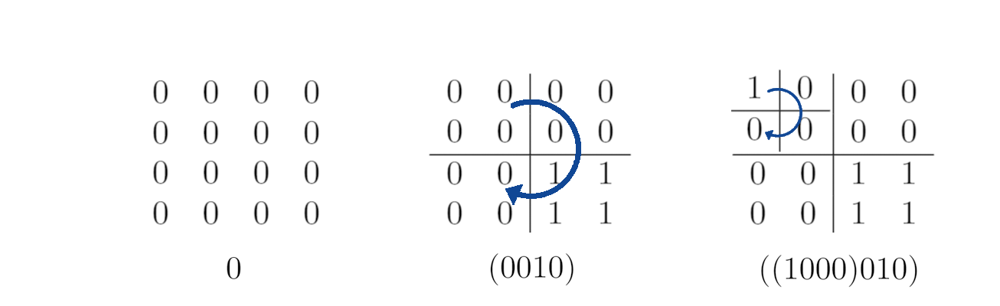

# Module 1: Computational Thinking

February 10, 2021

This is the very first module of the course Computational Thinking and Programming with Python (CoTAPP). Today we will look at what Computational Thinking means and do some exercises to start thinking computationally. Next time we will take it one step further and discuss how to analyze and describe all kinds of processes from a computational perspective. 


## Computational Thinking
Computational Thinking is considered one of the fundamental skills of the 21st century. It is about expressing problems and their solutions in ways that a computer could execute. The term was coined by Jeanette Wing in 2006 (see the [original article published in the Communications of the ACM](http://www.cs.cmu.edu/afs/cs/usr/wing/www/publications/Wing06.pdf) if you are interested) and has increasingly been adopted by educators around the world since then. 

We will practice Computational Thinking in different ways during this course, often without explicitly saying so. It is important to realize that Computational Thinking does not require specific programming or coding skills. That is, you can think computationally without knowing a single word of Python or any other programming language!

Computational Thinking comprises many different forms of thinking. One that is particularly close to programming is about giving (good) instructions. For example, what would you do with the following instructions?

`Take a piece of paper and a pen.`
`Draw a dot in the center of the page.`
`Draw a rectangle around the dot.`
`Write your name under the rectangle.`

You will probably produce something quite similar to this: 


What about the following instructions? 

`Take a piece of paper and a pen.`
`Draw two dots close to each other.` 
`Draw a short line.` 
`Draw a U-shape.` 
`Draw a circle around everything.`

Maybe you will produce something that looks similar to one of these: 


The instructions in the second example were less clear, and more open to interpretation, leading to somewhat unpredictable outcomes. Maybe you read all instructions before you started to draw, that might have given you a better idea of what was intended. The point is that computers do not work this way. They are not intelligent and cannot easily think along with the instructions as a human would do. They just execute instruction after instruction, literally. When instructions are not clear, computers will get stuck or do nonsense. Hence, when giving instructions to a computer it is important to be absolutely clear.

Therefore, programming languages provide well-defined vocabularies for giving instructions that can be understood by a computer. The challenge for programmers is to use these limited languages well to achieve what they want. 

Let us have look at a very simple but instructive example, inspired by the [Turtle graphics](https://en.wikipedia.org/wiki/Turtle_graphics) language. With this programming language you can give instructions to a "turtle" that draws lines while it walks over the paper. At the beginning of the program it sits in the center of the paper, at position (0,0) of a grid, and looks to the right (eastwards). Our version of the language has only four commands: 

1. `forward(x)` - Move forward by x pixels
2. `left(x)` - Turn left by x degrees.
3. `right(x)` - Turn right by x degrees.
4. `jump(x,y)` - Jump to position (x,y).

A program written in this language could look as follows: 

```
forward(100)
jump(0,0)
left(45)
forward(100)
jump(0,0)
left(45)
forward(100)
jump(0,0)
left(45)
forward(100)
jump(0,0)
left(45)
forward(100)
```

The output would be: 


Now imagine a not-to-complicated picture and write a program for the turtle to draw it. Only use the three commands above. How does it go?

Probably you will miss a lot of commands, for example for drawing curves and circles. Other versions of the turtle graphics language have these and some other useful commands. The point is that the instruction sets of programming languages are always limited, so this is a bold and simple illustration of one of the major challenges in programming: getting a computer to do complicated things with very simple means. You will see that also with a language like Python, which comes with many more commands and loads of libraries with additional comments, this principal challenge remains. While there are standard patterns for some situations, others require the programmer to get creative. We will see examples of both in the next weeks. 

Finally, note that also with a real programming language, it is easy to make mistakes. Programming mistakes are commonly called 'bugs'. Small bugs can cause big problems. Think, for example, of bugs in a program that controls traffic lights, airplanes or surgery robots that lead to unintended behavior. But also for data analysis programs, bugs can be problematic if they lead to wrong results and incorrect scientific conclusions (see [this article](https://doi.org/10.1021/acs.orglett.9b03216) for an illustrative example from cheminformatics). The more complex a program, the more likely it is to contain bugs, and the more difficult it is to find and fix them. This is another challenge that we will face in the next weeks. 


## Exercises

To get warmed up further on Computational Thinking, here some puzzles (inspired by and adapted from the [GI’s Informatik-Biber](bwinf.de/biber)) that require you to use different computational thinking skills. No programming experience needed, just read the instructions carefully and set your brain to work! :) 

Please use Quarterfall to submit and check your answers.

### 1. Download Times (★★★☆☆)

When downloading multiple files from the internet at the same time, the downloads share the capacity of the connection between them, each getting the same share. For example, when downloading 10 files at the same time, each of the downloads can use 1/10 of the capacity. Downloading a single file would be ten times as fast. 

Now consider the following situation (illustrated below): A user is downloading 4 files at the same time. For each file the remaining download time is displayed. This time is calculated based on the capacity of the internet connection (which stays the same all the time). How many minutes will it take until all 4 files have finished downloading?


### 2. Maximal Gain (★★☆☆☆)

The grid below contains numbers and two special cells S (for start) and G (for goal). The task: Find the path from S to G on which the sum of the numbers on the visited fields is the highest. But: you are only allowed to step upwards and to the right (not down or to the left). 

What is the maximal sum that can be gained this way, and through which path? 


### 3. Number Segments (★★★☆☆)

In a house with 10 floors the lift shows the current floor with a 7-segment digital number display. The numbers 0 (for ground floor) to 9 look like this: 


Thus, to display a number, at least 2 and at most 7 of the segments are switched on. 

Recently one of the segments was broken and did not switch on at all. Nevertheless it was possible to recognize all numbers and tell them apart. Which segment could have been the broken one?

### 4. Quarters (★★★☆☆)

Black-and-white bitmaps can be represented with the binary characters 0 and 1, as illustrated below: A 0 stands for a white pixel, and a 1 for a black pixel. A picture with 4 x 4 pixels can thus be encoded with 16 characters, and a picture with 8 x 8 pixels with 64 characters.


Many pictures can however also be represented with less characters. Therefore the characters are arranged in a square raster, and the following procedure is applied: 
* If all characters in the raster are 0, the result is the character 0.
* If all characters in the raster are 1, the result is the character 1. 
* Otherwise the raster is split into 4 rasters of same size, and the procedure is applied to all of these rasters, starting with the upper left and proceeding in clock-wise direction. The result is then created as follows: The four results are written after one another, between the brackets ( and ). 

Here are three examples of how the procedure works on a 4 x 4 raster: 



What is the result for the 8 x 8 raster below?


*Extra question*: How many characters would the procedure save when applied on the coffee bitmap from above?

### 5. Filter (★★★☆☆)

A gray-scale bitmap can be saved as a table or grid, with values of 1 to 5 for each pixel. The value 1 stands for black, the value 5 stands for white, and the values 2 to 4 stands for the lighter-getting shades of gray between them.

A filtering algorithm computes a picture of same size for a given original according to the following procedure (illustrated on an example below):

For each pixel in the original picture, it takes  the value of the pixel and its eight neighboring pixels, sorts them from smallest to largest, and then takes the value in the middle, i.e. the 5th of 9 values, as the new value of the pixel in the filtered picture. 


When applied to the leftmost picture below, which of options A-D is the result? 

