# Module 02: Activity Diagrams

February 12, 2021

Last time we got started with thinking computationally. We saw that two things are important if you want to program: 1) You need to know what you want to do, and 2) you need to tell the executing machine how to do that for you. 

Today we will look at techniques for expressing what you want to do at different levels of abstraction. These plans are formalized in such a way that they can serve as guidelines for the next step on the way to actually useful software, the writing of executable code in a programming language. We also say that we design or model the program before we implement it. Doing this is important in particular when dealing with more complex computational problems, where a good concept for a program is not easily imagined just mentally. 

Next time we will start with Python and learn how to translate these plans or designs further into a language that the computer will be able to understand. 

## Modeling Processes with Activity Diagrams

UML Activity Diagrams are a well-known technique to describe processes at different levels of abstraction. They can for example be used for designing a data analysis process, prior to its implementation in a concrete programming language like Python. UML stands for "Unified Modeling Language". It has been developed as a set of modeling formalisms for the design and description of software systems. UML Activity Diagrams describe processes, that is, the sequencing of activities, and are also suited to express conditional and parallel behaviors. They are particularly useful for workflow modeling and behavioral descriptions of programs.

Let us have a look at some simple examples with real-world processes. 

### Example 1 (sequential execution): How to cook Heinz Beanz in the microwave

“Empty contents into a microwaveable container and cover. Heat on full power for 1 ½ minutes. Stir. Heat for a further 1 minute.”

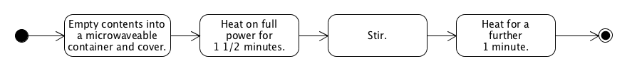

This is an example of a 4-step sequential process: Four activities (the rounded rectangles) are executed one after another (transitions denoted by the arrows between the activity nodes). Note that the black dot and the black dot with the white circle denote the start and end point of the process, respectively.

### Example 2 (parallel execution): How to prepare pasta with tomato sauce 

“Buy pasta and tomato sauce. Bring 2 liters of water to the boil in a large pot. Add pasta. Cook for 10 min. Strain pasta. In the meantime put tomato sauce into a small pot. Heat slowly. Put pasta and tomato sauce onto a plate. Enjoy!”

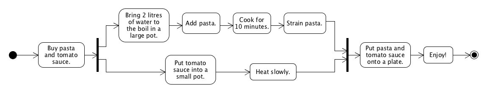

This process contains another element: the black bar, which denotes forks (splitting one transition into several ones) and joins (joining several transitions into one). This enables the description of parallel or concurrent behavior in the part of the process between the bars. 

### Example 3 (conditional execution): How to get your morning coffee as you like it 

“Make coffee. Add milk? If yes, add milk. Add sugar? If yes, add sugar. Enjoy!”

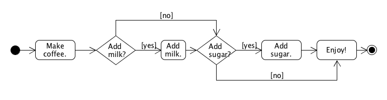

Here is another element: the diamond. This can be used to model conditional behavior, as only one of the outgoing transitions will be taken during execution, depending on the result of the evaluation at the node. 

### Example 4 (pre-test loop): How to season your dish from the canteen

“Get dish. Does it need extra salt? If yes, add a bit of salt and go back to checking again. If not, enjoy!”

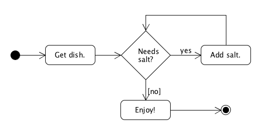

Here is the diamond again, but because one of its successors transitions back to the condition, the result is a (pre-test) loop that repeatedly executes the activities in the loop’s body as long as the condition is met. 

### Example 5 (post-test loop): How to eat up a bag of marshmallows 

“Open bag. Take marshmallow. Eat it. Are there any marshmallows left? If yes, go back to taking one. If not, dispose of bag.”

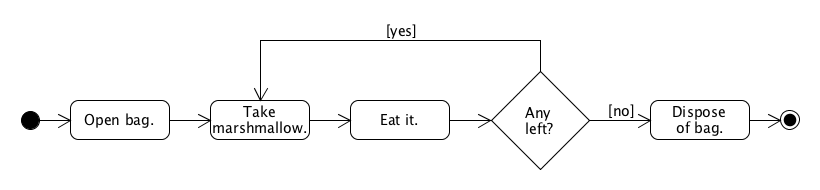

And again the diamond, but this time used to model a post-test loop. The condition at the diamond is used to transition back to a previous process step in one case. 

### Example 6 (data objects and swimlanes): Document Management Process

Here is another example, taken from https://www.uml-diagrams.org/document-management-uml-activity-diagram-example.html, that describes a general document management process. 

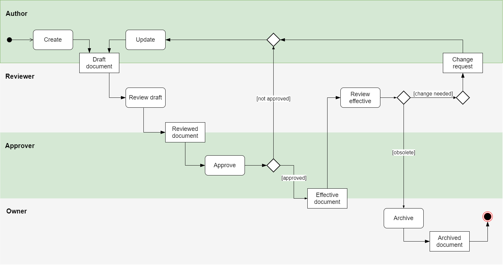

It shows two further elements: 1. Normal, non-rounded rectangles can be used to represent data object during the process. Note that the absence of such rectangles does not mean that there is no data involved in the process. Typically they are only used for essential objects in a process that should get attention at the abstraction level of the model. 2. The diagram makes use of “swimlanes” to distinguish the activities of different actors. This is typically used for collaborative processes where it is important to represent what different actors are responsible for. 

### Example 7 (hierarchical diagrams): Web Shop

When processes get larger and more complex, it is useful to organize Acitvity Diagrams hierarchically. Here is an example of a simple web shop process: 

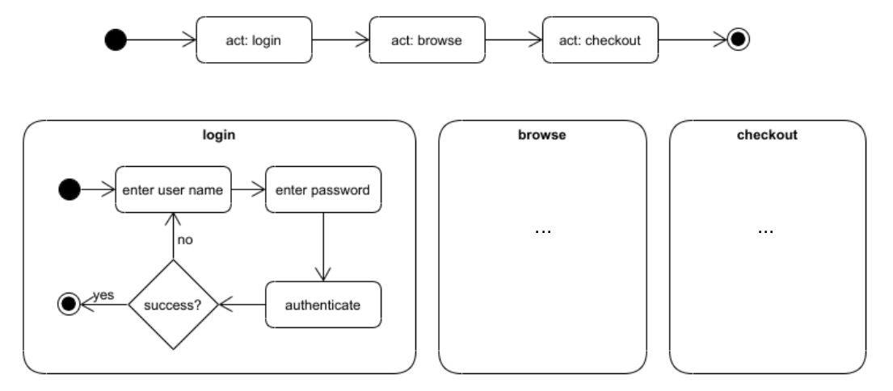

The diagram at the top of the figure shows the top-level process of a web shop, where you have to log in before you can browse the articles and finally go to checkout. The use of the prefix "act:" in the activity nodes indicates that they refer to another diagram that defines the activity in more detail. The "login" diagram is shown as an example. 

It is also possible that such sub-diagrams refer to other sub-diagrams again, hence there is no limit to the number of hierarchies that one can use. A general rule of thumb is that it should not be more than 5-7, depending on the complexity of the processes being modelled. 

Furthermore, with this mechanism it is possible to re-use Activity Diagrams in more than one place in other diagrams. For example, the login functionality may be required at different points of a more complex web shop process (for example one that allows browing without logging in first, and only requires it before checkout). We could then simple write "act: login" in the activity node, referring again to the already defined process.

### Summary of important elements and patterns

The table below summarizes the most important basic elements and control-flow patterns of UML Activity Diagrams, which were used in the examples above. 

| Element | Notation | Description |
| --- | --- | ---|
| Initial node |  | Starting point for execution. |
| Final node |  | End point of execution.|
| Activity (aka Action) | 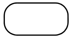 | Rounded rectangle denoting a state of doing something. Can be a real world-process (e.g. typing a letter), the execution of a software routine (e.g. API method, service call), or a reference to another Activity Diagram.|
| Transition (aka Control Flow) | 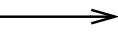 | Arrow for connecting nodes, defining the order in which they are executed.|
| Sequence | 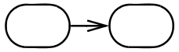 | Two activities connected by a transition, denoting their sequential order of execution. |
| Decision (aka Branch, Conditional Branching, Exclusive Choice) | 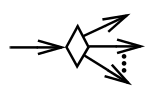 | Diamond shape with a single incoming transition and several guarded outgoing transitions. Only one of the outgoing transitions can be taken, so the guards should be mutually exclusive. |
| Merge | 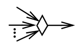 | Diamond shape with multiple incoming transitions and a single outgoing transition. A merge marks the end of conditional behavior started by a branch. It is optional (a merge can also happen directly at an activity), but it can help to improve the readability of the diagram. |
| Fork (aka Parallel Split) | 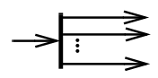 | Black bar (horizontal or vertical) with one incoming transition and several outgoing transitions. When the incoming transition is triggered, all of the outgoing transitions are taken in parallel. | 
| Join (aka Synchronize) | 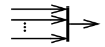 | Black bar (horizontal or vertical) with multiple incoming transitions and a single outgoing transition. The outgoing transition is taken only when all the states on the incoming transitions have completed their activities. | 
| Object node (data object) | 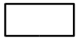 | Rectangle (not rounded). Used to describe object flow between activities. | 
| Data flow |  | Arrow for connecting object nodes and activities, describing the flow of data. | 

## Exercises

Please use Quarterfall to submit and check your answers. 

### 1. Understanding Activity Diagrams (★★☆☆☆)

1. “Slime” is currently popular among children. The following instructions describe how to make it: 
    
    *Add 7 tablespoons of skimmed milk to a cup. Add 1 tablespoon of vinegar. Gently stir the mixture until solids have formed. Let the solids sink to the bottom. Drain off the liquids using a filter. Add ¼ teaspoon of baking soda. If you want colored slime, add food coloring to the mixture. Knead together to form a slimy mixture.* 

    Which of the Activity Diagrams shown below corresponds to these instructions?

    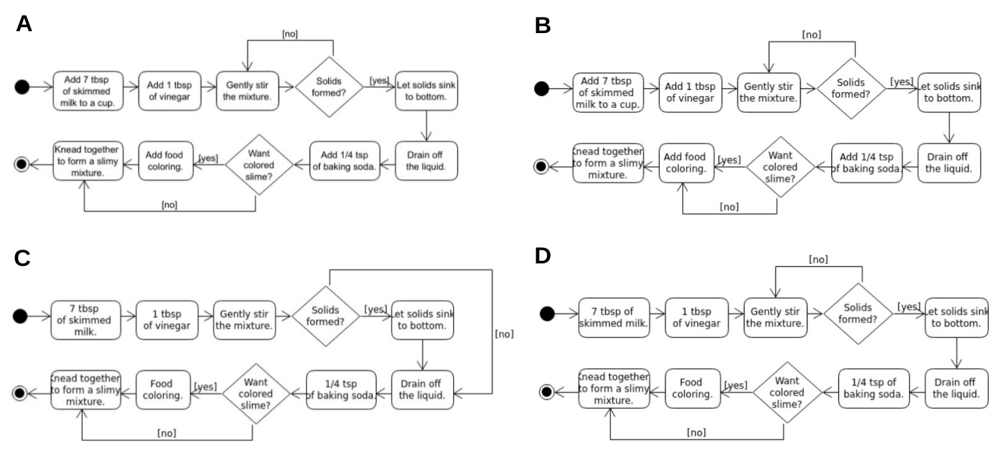
    

2. Which control-flow patterns are used in the (correct) "slime" Activity Diagram?
    * sequence
    * conditional branching
    * pre-test loop
    * post-test loop
    * parallel execution
    

3. The Activity Diagram shown below describes how to make eggs on toast. 

    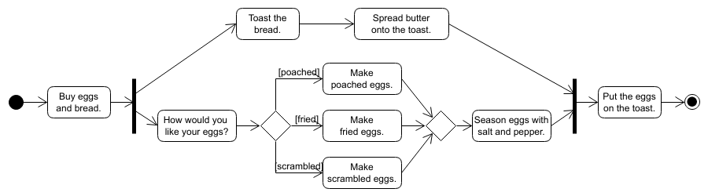

    Which of the following statements about this description are correct?
    * The first step is to buy eggs and bread.
    * The second step is to ask the eater how they would like their eggs.
    * The eggs are seasoned with salt and pepper after the butter has been spread onto the toast.
    * Only fried eggs are seasoned with salt and pepper.
    * The preparation of the toast and the preparation of the eggs happen in parallel.
    * It is possible that raw eggs are put on the toast.
    * It is possible that the eggs are put on toast before being seasoned with salt and pepper.
    * Eggs are either poached, fried or scrambled.
    
    
4. Which control-flow patterns are used in the "eggs on toast" Activity Diagram?
    * sequence
    * conditional branching
    * pre-test loop
    * post-test loop
    * parallel execution
    

### 2. Describing Activity Diagrams (★★★☆☆)

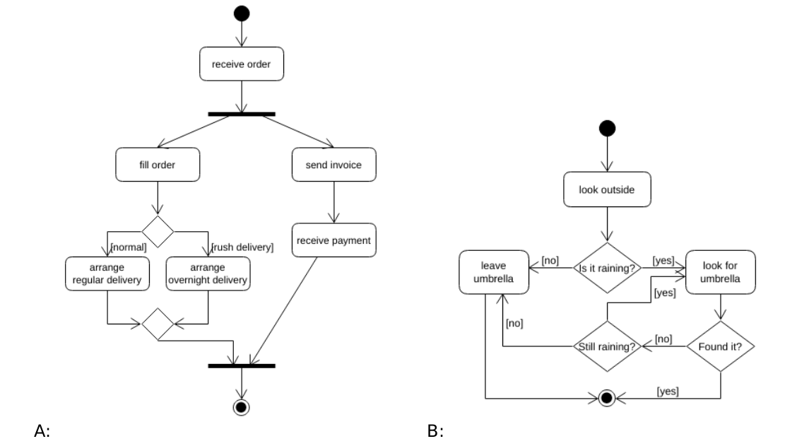

For the diagrams A and B above, summarize in your own words the processes that they describe and the steps involved in these processes. Additionally, list the control-flow patterns that they include.

### 3. Creating Activity Diagrams (★★★☆☆)

In this exercise you are asked to create some UML Activity Diagrams yourself. You can draw them using pen and paper, with an office or graphics software, or use a specialized editor like UMLet (http://www.umlet.com, installation required) or the browser-based UMLetino (http://www.umletino.com/umletino.html).

1. Convert the following instructions (for a possible morning routine) into an Activity Diagram: “Get out of bed. If you need to use the bathroom, use it. Eat breakfast while watching the news. If today is a weekday, put on work clothes and go to work. If today is not a weekday, put on leisure wear and make a plan for the day.”

2. Convert the following instructions (for crossing a street) into an Activity Diagram: “Look left. Look right. Are there any cars coming? If not, cross the road. If yes, wait for 5 seconds and then start looking left again.”

3. Create an Activity Diagram for a simple "Guess the number!" game, where the player has to guess a randomly selected number between 1 and 10. The process is roughly the following: The computer randomly selects a number between 1 and 10, then asks the player to guess it. The player enters a number. The computer checks if it is smaller, equal or greater than the number to guess. If smaller/greater, it displays "Too small!"/"Too big!" and goes back to letting the player enter a number. If equal, it displays "Yes!". Then it asks the player if he wants to play again. If yes, it goes back to the beginning, if not, the game ends.

4. Think of some process that you have learned about in your studies. Describe it briefly in natural language and then in form of an Activity Diagram. Don't make it too easy for yourself: Your diagram should contain at least 5 nodes and should not only be sequential.

## Extra for the Weekend
For a bit of nostalgia with both entertainment and educational value, check out [“Remington-Rand presents the Univac”](https://www.youtube.com/watch?v=j2fURxbdIZs) on YouTube. It’s a hilarious early 1950s commercial for the Univac, one of the earliest commercial computers. The advertised machines are of course hopelessly outdated now, but the basic programming principles explained there still apply today: The programmer first makes a plan for the program (for example in the form of a flow chart or activity diagram), which is in the next step translated into actual code that can be processed by the computer.