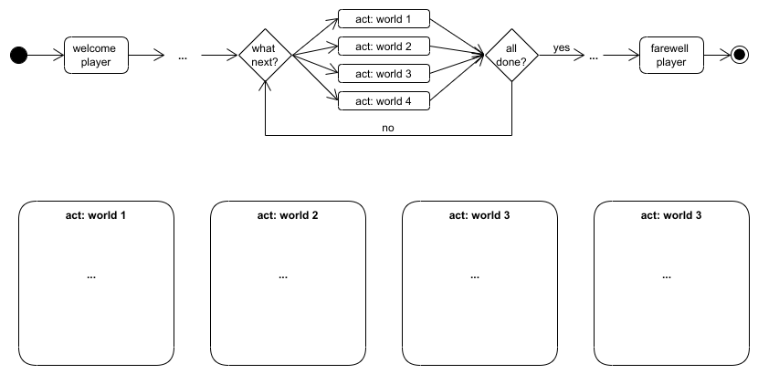

# Project 1: Text Adventure

In this first group project you will design and implement a text adventure game in Python. We will only have discussed all programming concepts that are needed next week, but you can right now start with the first part (design of the game concept as Activity Diagrams). 

Project 1 needs to be submitted through Blackboard by **March 2, 2022, 13:00**. Make sure to include in the submission the Activity Diagrams (as images), all your code (as .py files) and if applicable any other relevant project files, combined into **one .zip file**.

## Assignment
Text adventures are computer games with text-based user interfaces. They are much easier to program than complex 3D action games, but if designed well they can also be quite intriguing. Typically, a text adventure describes its “world” to the player in a narrative text, and asks the player to submit simple text inputs to interact with the world. These can be conversations with characters in the world, questions, quizzes, assignments, etc. Often the player collects points, coins or other tokens during the game, which they need to complete the game or to trade in for other tokens as the game goes. If you would like to read more about the genre of text adventures, the [Wikipedia article on Interactive Fiction](https://en.wikipedia.org/wiki/Interactive_fiction) might be interesting for you.

Your task for this project is to design and implement a text adventure that takes the player through the
“worlds” of the group members. Each group member should therefore develop a part of the game (call
it world, or level, if you like) based on their study subject or another area of interest (think of hobbies,
professional experience, special skills, …). Make it interesting for the player! The idea is to share the
games with the rest of the course after the project, and let people play the other groups’ games. 

Be creative, but make sure that your text adventure meets the following requirements:

1. When the player starts the program, the main program welcomes them and asks for their name.  
2. From the main program the player can enter the different worlds. When they completed a world, they return to the main program.  
3. When the player has completed all worlds successfully, the main program congratulates them and ends the game.  
4. Each group member develops (at least) one world, implemented in a separate function.  
5. Each world can be completed by the player, if necessary by starting the world again and trying another route. There is no ultimate “game over” state.

Split the work on the project in two parts, roughly corresponding to the two weeks you have for the
project: Game design (with Activity Diagrams) and game implementation (with Python). 

### Part 1: Game Design
Design your text adventure as a (hierarchical) Activity Diagram first. The diagrams are your guidance for the implementation part. Below is an incomplete sketch of an Activity Diagram describing the text adventure that you can use as a starting point. 

### Part 2: Game Implementation
Start implementing the game as you learn the required programming concepts in the lecture. After
module 6 you will have everything you need, but you can already start with parts of the game earlier. 

## Tips
Ask your lab group tutor for help and feedback early and regularly. Don’t wait until you are really stuck
somewhere. Often it is difficult to fix programming problems that are caused by poor design decisions
made early in the project.

Check the project grading rubric. This will give you a clearer idea of what is important to focus on.

You can share your project files through Blackboard. At some point you might also want to work
together on your code during a video call. Three out of several options to do that, should you need to have your meetings online:

* One of you shares their Spyder screen and does the editing, while you discuss it together.

* You use a collaborative coding environment like [https://repl.it/site/multiplayer](https://repl.it/site/multiplayer), and put the code back to Spyder/Blackboard when you are done there.

* Microsoft’s Visual Studio also supports live sharing and collaborative editing of code, see [https://visualstudio.microsoft.com/de/services/live-share/](https://visualstudio.microsoft.com/de/services/live-share/) for more information.