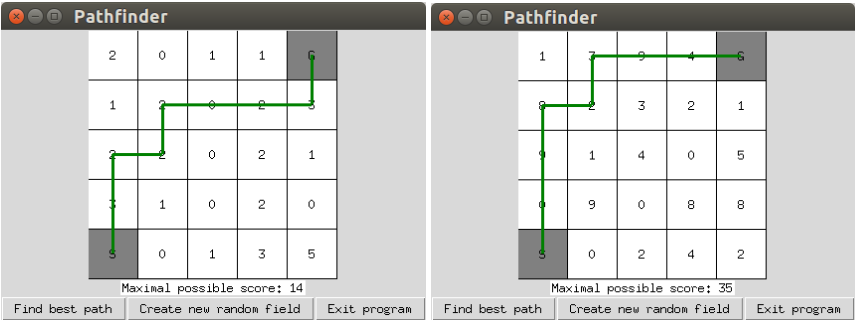

# Project 4: Pathfinder

In this group project you will revisit the “Maximal Gain” Computational Thinking exercise from
Module 1 and develop a graphical user interface for searching and checking the best paths through a
grid. The project is designed to let you practice with object-oriented programming and graphical user
interfaces with Tkinter, as well as with algorithmic thinking. 

Project 4 needs to be submitted through Blackboard by **April 14, 2021, 13:00**.
Make sure to include in the submission all your code (.py files) and any other required files (e.g. input
files), combined into **one .zip file**.

## Assignment
This project revisits the Computational Thinking exercise “Maximal Gain” from the first module: 

 
 
<em>The table on the left contains numbers and two fields <strong>S</strong> (for start) and <strong>G</strong> (for goal). The task: Find the path from S to G on which the sum of the numbers on the visited fields is the highest. But: you are only allowed to step upwards and to the right (not down or to the left). 
  What is the maximal sum that can be gained this way, and through which path?</em>   

Your task for this project is to use Tkinter to build a GUI that represents the grid (take the one above as
the first/default one) and that has three buttons to 1. find the best path (and draw it to the grid), 2.
generate new random numbers for creating another instance of the path-finding problem, and 3. exit the
program. The GUI in action could look something like: 

The two major challenges here are to draw the grid (with and without the best path) and to find the best
path automatically. There are many different ways to do achieve this, but here are some pointers:
* Create an object (as field of the application class) that always contains the current values in the grid. This object can be just a list of lists, or a self-defined class. Use it as input for filling the grid with values as well as for the computation of the best path. Also, the creation of a new field should basically mean to fill this object with new numbers, and based on that draw the grid to the canvas again. 
* The algorithm for finding the best path does not need to be particularly smart or optimal, a “brute force” implementation (trying out all possibilities) is okay. Keep in mind that the pathfinder is only allowed to go up and to the right, and in fact it will always go 4 x up and 4 x right (just in different combinations), which limits the number of possibilities as compared to all possible paths if it was allowed to move into all directions.

Make sure that your program meets the following requirements:
1. The GUI contains at least the elements (grid, label, three buttons) described above.
2. A click on the “find best path” button leads the program to compute and display the best path for the current grid. It also updates the score displayed in the text label below the grid.
3. A click on the “create new random field” button fills the grid with new, randomly generated numbers between 0 and 9. It also resets the score displayed in the text label below the grid.
4. A click on “exit program” closes the program.

Feel free to be creative and add additional features. For example, allow the users to click on cells in the
grid to change their color, that way marking them as part of the path that the users think is the best.
Then they can let the program show the best path and check if they were right. Or even let the program
check if a user’s path is the best one. You could also collect statistics about how many times a user
needed to try before they found the best one, and display these somewhere in the interface. Or (try to)
create an executable/installer of the program for your platform, and let friends and family try to play
with it! :)

## Tips
Ask your tutors for help and feedback early and regularly. Don’t wait until you are really stuck
somewhere. Often it is difficult to fix programming problems that are caused by poor design decisions
made early in the project.

Check the project grading rubric. This will give you a clearer idea of what is important to focus on.

You can share your project files through Blackboard. At some point you might also want to work
together on your code during a video call. Three out of several options to do that: 
* One of you shares their screen with Spyder and does the editing, while you discuss it together. 
* You use a collaborative coding environment like [https://repl.it/site/multiplayer](https://repl.it/site/multiplayer), and put the code back to Spyder/Blackboard when you are done there.
* Microsoft’s Visual Studio also supports live sharing and collaborative editing of code, see [https://visualstudio.microsoft.com/de/services/live-share/](https://visualstudio.microsoft.com/de/services/live-share/) for more information.